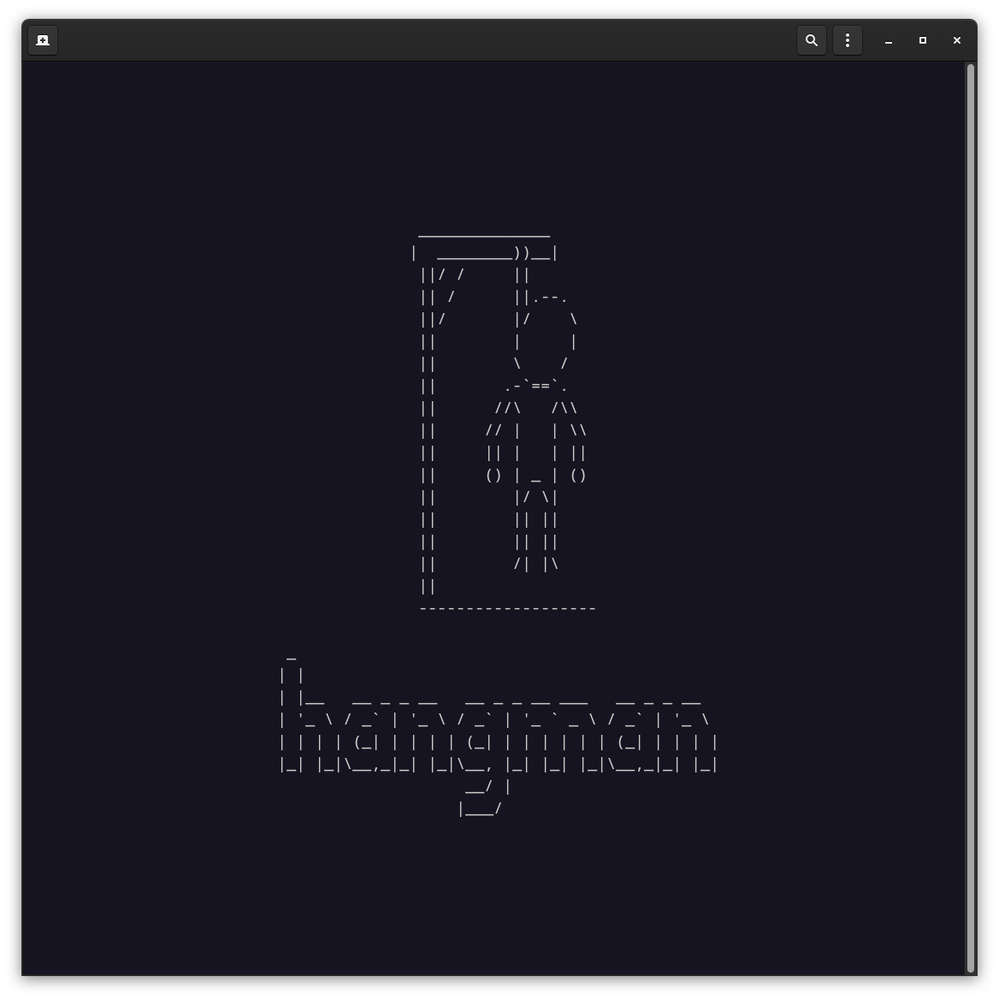
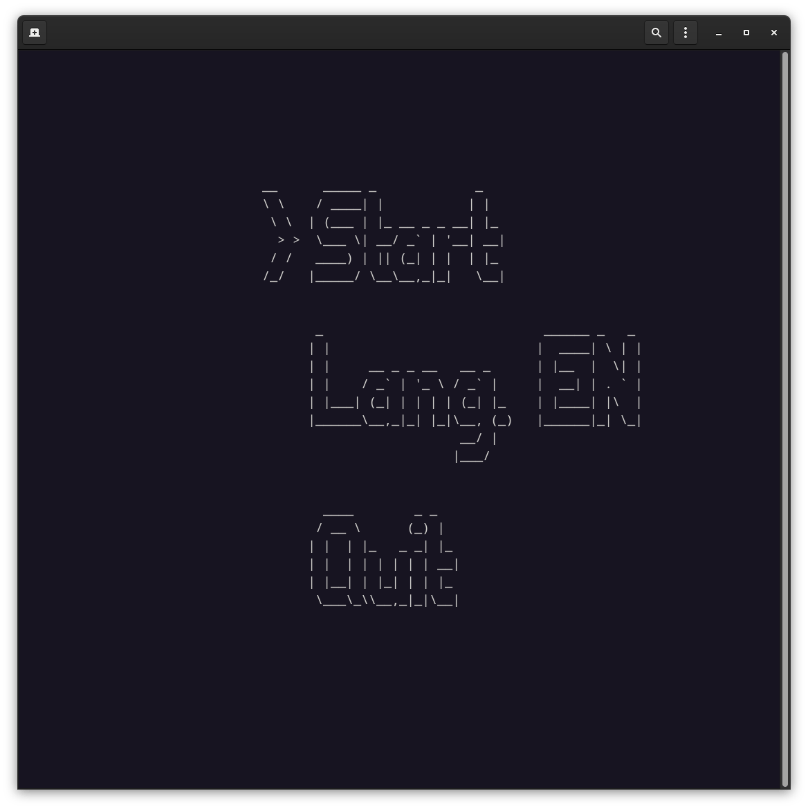
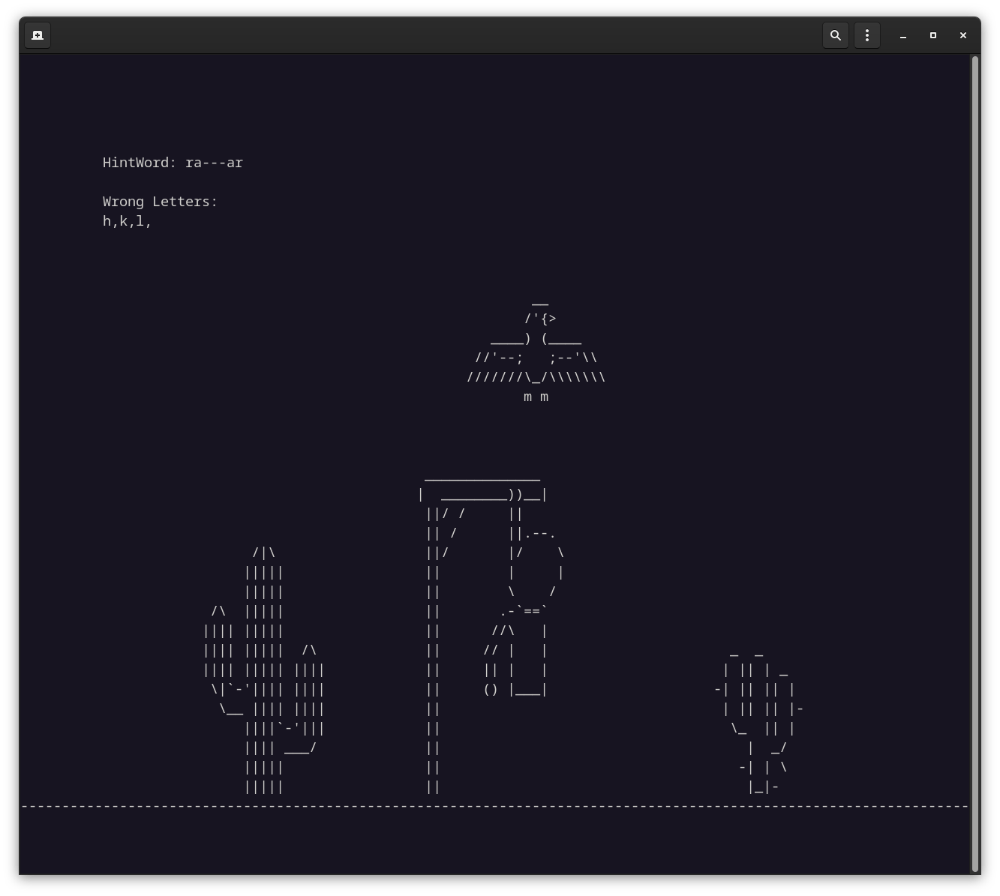

<h1> ASCII-Hangman </h1>
Hangman written in C with ncurses

<h2> Short description of the game principle </h2>

  The initial screen consists of a gallows, which is still empty at the start of the game. A random word is chosen, but its letters are replaced by hyphens. The player now enters individual letters of the alphabet that he suspects are in the word. If the player guesses a correct letter, all hyphens are replaced with the letter at the correct location. The word is thus gradually revealed. If a guessed letter does not appear in the word, a part of the hanged person's body is added. After 6 mistakes, the hangman is completed and you loose. However, if you manage to get the complete word before that, you win the game.

<h2> Input options during the game </h2>
<ul>
<li>The arrow keys are used to navigate the menu</li>
<li>To return to the main menu use the ESC key</li>
<li>During the game, the A-Z keys can be used for guessing letters.</li>
</ul>

<h2> Screenshots </h2>

  
  
  

